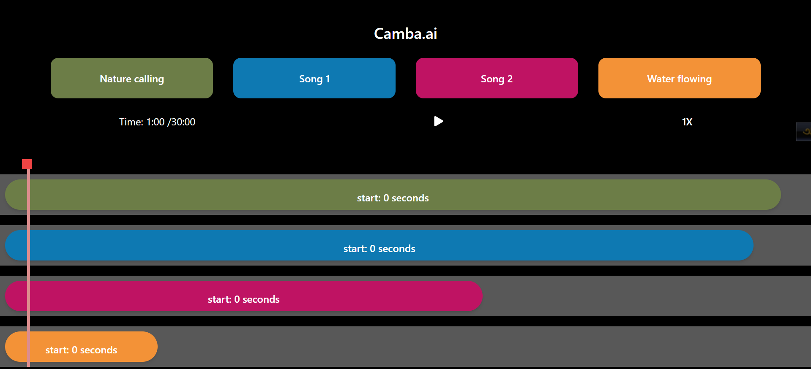

# Audio Pill Player

## Description
The Audio Pill Player is a React-based application that allows users to play multiple audio tracks simultaneously. It features a draggable playhead, dynamic audio track additions, and real-time updates on the playhead's position.

## Features
- Play multiple audio tracks concurrently.
- Draggable playhead for precise control.
- Dynamic addition of audio tracks by clicking on corresponding buttons.
- Real-time updates on the playhead position and a 30-second timer.
- Playback controls including play, pause, and adjustable playback speed.

## Demo
You can view a live demo of the Audio Pill Player [here](https://audio-player-sigma-three.vercel.app/).

## Technologies Used
- React
- react-draggable library

## How to Use
1. Clone the repository.
2. Install dependencies using `npm install`.
3. Start the application with `npm start`.
4. Open the application in your web browser.

## Usage
- Click on audio buttons to add tracks to the player.
- Drag the playhead to navigate through the audio timeline.
- Use playback controls to play/pause the audio.
- Adjust playback speed with the speed toggle.

## Screenshots

